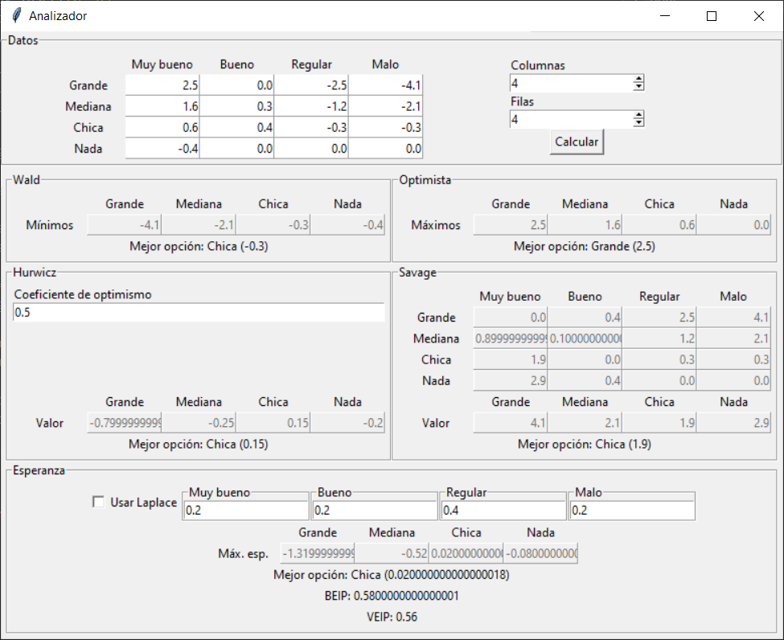

# Criterios para la toma de decisiones con variables discretas

Este trabajo consiste en un programa que permite completar una tabla de acciones y estados de la naturaleza con el objetivo de analizar los datos indicados según los criterios para la toma de decisiones con variables discretas que se vieron en clase.

Algunos de los criterios requieren parámetros adicionales que se pueden especificar.

Los criterios incluidos son:

- criterio de Wald, maximin o pesimista

- criterio maximax u optimista

- criterio de Hurwicz

- criterio de Savage o de arrepentimiento

- criterio del máximo beneficio esperado

Además, calcula el beneficio esperado con información perfecta (BEIP) y valor esperado con información perfecta (VEIP).

## Cómo ejecutar el programa

1. clonar el repositorio con el comando `git clone https://github.com/exe-quiel/decision-variable-discreta.git` o descargar los archivos `main.py`, `criterios.py`, `table.py` y `utils.py` en un mismo directorio

2. hacer doble clic en `main.py` o, desde una terminal, ejecutar `python main.py`

**IMPORTANTE:** es necesario usar Python 3.

## Cómo utilizar el programa

El programa carga por defecto los valores de uno de los ejercicios vistos en clase. Para cambiar los valores, basta con modificarlos en la sección de datos. Se pueden modificar los nombres de las acciones y de los estados haciendo clic sobre ellos.

Para volver a realizar el análisis, se debe hacer clic en el botón Calcular de la sección de datos.

**IMPORTANTE:** al hacer clic en los botones para incrementar o decrementar la cantidad de filas o columnas, los nombres se resetean, es decir, vuelven al valor que tenían originalmente al abrir el programa. Lo ideal es elegir primero la cantidad de filas y columnas necesarias y luego editar los nombres.
